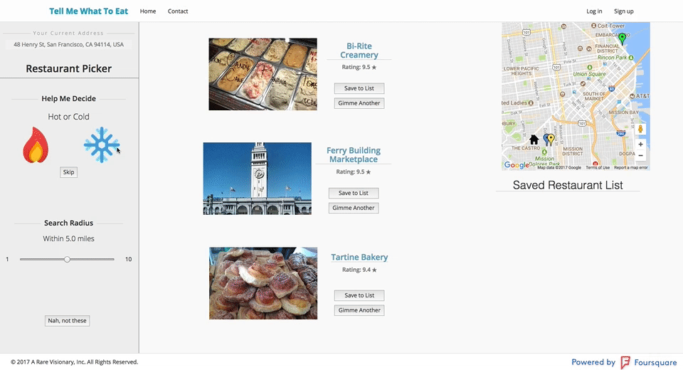

Github: [Tell Me What to Eat](https://github.com/ravisraval/TellMeWhatToEat)

Live: [Tell Me What To Eat](https://boiling-waters-62095.herokuapp.com/)

Tell Me What To Eat is a decision-making app that uses an algorithm-like process to reduce choice and make satisfying but less difficult choices.

## Background and Overview

  TellMeWhatToEat solves one of the world's most pressing issues: what should we eat tonight? Who will decide this for us? With so many choices, how can we possibly decide? Choice overload is a real thing, and that's what we're addressing. Using your current location, TellMeWhatToEat generates a customized suggestion just for you. Optionally, put in some filters. Want cheap, hot food? We got you. Need to take the prime minister of Malaysia out to one your town's best restaurants? Let us know, and we'll send you a top shelf suggestion.

## Functionality and MVP

Users can immediately click a button to generate a small list of random food/restaurant choices based on user location.

Users can optionally respond to filtration questions to narrow down their options.

Additionally, users can set a radius for the search.

Users can create accounts.

A map with the user's location and each restaurant populates upon searching.

Users can temporarily designate restaurants to a list for easier viewing.

## Technologies and Technical Challenges
###### Tech Stack
  *  Backend: Node.js with an Express.js framework and a PostGreSQL database
  *  Frontend: React with a Redux architecture

###### Retrieving Restaurant Data
A key technical challenge was the retrieving of data from existing databases, storing it on the front end during user interaction, and selectively rendering that information.

Chiefly, we utilize the FourSquare API to collect relevant restaurant information.

###### Filtering & Processing Restaurant Data

  * Users submit their location on the landing page. If they do not provide their location, the app checks their location from browser data. The app then makes an API call to FourSquare and loads a list of pertinent restaurants.
  * The user then inputs data to filter these results, and the app returns a corresponding list of restaurants.

###### Sorting Data According to User Input
  *  Generating useful algorithms by which to sort user input.

## Things Accomplished Over the Weekend
  *  Full stack setup: React, Express, NodeJS, Webpack, PostegreSQL.
  *  Authentication setup.
  *  Clean up FourSquare data and begin to breakdown possible categorization algorithms
  *  Functionally installed GooglePlaces API

## Group Members and Work Breakdown

  - [x] day 0: Stack set-up, front- and back-end auth
  - [ ] day 1: Experimenting and finalizing API integration
    - Aaron: Figuring out backend implementation of API authorization; render search results
    - Syrie: Clean up data, begin sorting through categories and generating preference-based filtering algorithms
    - Ravi: Figuring out frontend implementation of API integration; building component structure
  - [ ] day 2: Building out forms and react components
    - Ravi: Building out preferences forms back-end to establish preference lists
    - Aaron: Building out prefereneces front-end
    - Syrie: Build user profile front and back-end
  - [ ] day 3: Generate and fine-tune filtering algorithms
    - Collaborative brain-storming
    - Syrie: frontend display of sequential preference filtering algorithms
    - Ravi: frontend but behind the scenes manipulation of API data
    - Aaron: Testing and debugging and fine-tuning of other front-end elements
  - [ ] day 4: Perfecting filtering algorithms and UX
    - continuation of day 3 assignments
  - [ ] day 5: Styling and continue perfecting algorithms and UX
    - collaborative brainstorming on how to improve algorithm responses
    - asssignments: TBA depending on algorithm improvement
    - Syrie: Styling and UX improvement
  - [ ] day 6: Bonus features and bug-testing
    - respective assignments dependant upon progress
  - [ ] day 7: Styling, seeding and setting pre-set preferences
    - collaborative brainstorming on preference setting
    - respective assignments TBD

## STRETCH GOALS:
*  Add in specific meals for recommendations.
*  Visualize user preferences on a user dashboard.
*  Pixel-perfect mobile-responsive design.
*  Mobile App
*  Fetch menus
